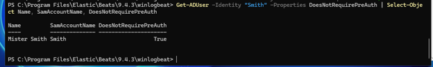
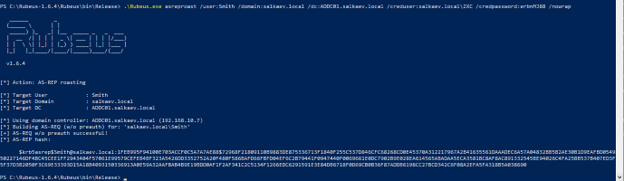
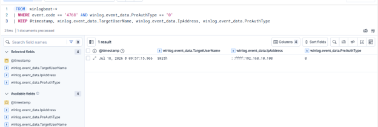

# AS-REP Roasting Attack — AD Lab Report

**Lab:** salkaev.local (Windows Server AD Domain Controller + Windows 10 client)  
**Target account:** `Smith` (user account with Kerberos Pre-Authentication disabled)  
**Tools used:** Active Directory, PowerView, Rubeus 1.6.4, Elastic Security (ES|QL)

---

## Objective

Simulate an AS-REP Roasting attack against a vulnerable Active Directory user account, obtain an AS-REP hash without prior authentication, and develop an Elastic ES|QL detection capable of identifying AS-REP Roasting activity.

---

## Background

AS-REP Roasting is a credential access technique that targets Active Directory accounts configured with the **"Do not require Kerberos preauthentication"** option.

Unlike Kerberoasting, AS-REP Roasting does not require a Service Principal Name (SPN). When Kerberos pre-authentication is disabled, an attacker can request an Authentication Service Reply (AS-REP) directly from the Domain Controller without knowing the user's password.

The returned AS-REP message is encrypted using the target user's password-derived key and can be cracked offline using password recovery tools such as Hashcat. This attack is mapped to **MITRE ATT&CK T1558.004 – AS-REP Roasting**.

---

## Step 1 — Identify a Vulnerable User Account

Before performing the attack, I verified that the target account had Kerberos pre-authentication disabled.

Using PowerView, I queried the Active Directory attribute **DoesNotRequirePreAuth** for the user **Smith**.

```powershell
Get-ADUser -Identity "Smith" -Properties DoesNotRequirePreAuth |
Select-Object Name, SamAccountName, DoesNotRequirePreAuth
```



The output confirmed:

- **User:** `Smith`
- **DoesNotRequirePreAuth:** `True`

**Why this matters**

AS-REP Roasting is only possible when Kerberos pre-authentication is disabled. In properly configured enterprise environments this setting is uncommon, making such accounts attractive targets for attackers.

---

## Step 2 — Request the AS-REP Hash

I used **Rubeus v1.6.4** to request an Authentication Service Reply (AS-REP) for the vulnerable account.

```powershell
Rubeus.exe asreproast /user:Smith /domain:salkaev.local /dc:ADDC01.salkaev.local /nowrap
```



Rubeus successfully requested an AS-REP response from the Domain Controller without requiring prior authentication.

The output contained:

- **Target User:** `Smith`
- **Target Domain:** `salkaev.local`
- **Target DC:** `ADDC01.salkaev.local`
- **AS-REP hash** suitable for offline password cracking

Unlike Kerberoasting, no authenticated Kerberos service ticket request was required.

---

## Result

The attack successfully demonstrated the complete AS-REP Roasting workflow:

- Identified a vulnerable user account.
- Confirmed Kerberos pre-authentication was disabled.
- Requested an AS-REP response without authentication.
- Extracted an AS-REP hash suitable for offline password cracking.

---

## Detection in Elastic

After replaying the attack, I implemented an **ES|QL** detection rule that identifies Kerberos Authentication Service requests (Windows Security Event ID **4768**) where Kerberos pre-authentication was not used.

```sql
FROM winlogbeat-*
| WHERE event.code == "4768"
    AND winlog.event_data.PreAuthType == "0"
| KEEP @timestamp,
       winlog.event_data.TargetUserName,
       winlog.event_data.IpAddress,
       winlog.event_data.PreAuthType
```

The query successfully detected the AS-REP Roasting activity generated during the lab.



The detection returned:

- **Event ID:** 4768
- **Target User:** `Smith`
- **PreAuthType:** `0`
- **Source IP:** `::ffff:192.168.10.100`

A **PreAuthType** value of **0** indicates that Kerberos pre-authentication was not performed, which is a key indicator of AS-REP Roasting against accounts configured without pre-authentication.

Although legitimate accounts may be intentionally configured this way, such events should be rare and warrant investigation.

---

## Detection Recommendations

This detection can be improved by adding additional logic:

1. Alert only for user accounts that are not expected to have pre-authentication disabled.
2. Correlate multiple Event ID **4768** events with **PreAuthType = 0** originating from the same source IP within a short time period.
3. Alert when multiple different user accounts generate AS-REP responses from a single source host.
4. Combine Event ID **4768** with subsequent offline password attack indicators for higher-confidence detection.

---

## Environment

- **Domain:** `salkaev.local`
- **Domain Controller:** `192.168.10.7`
- **Attack Host:** Windows 10 (VirtualBox VM)
- **Detection Platform:** Elastic Security (ES|QL)
- All testing was performed exclusively within my isolated Active Directory home lab. No production or external systems were involved.